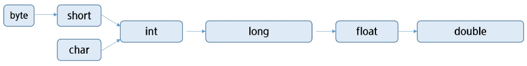

# Java 기본

## 자바 가상 머신(JVM, Java Virtual Machine)

- 자바 바이트코드를 실행할 수 있는 주체
- 자바 바이트코드를 기계어로 번역하여 특정 플랫폼의 실제 하드웨어에서 실행
    - 바이트코드: 소스코드와 기계어 사이의 중간단계
- JVM은 플랫폼 독립성을 가능하게 함
    - C/C++에서는 코드를 컴파일해서 기계어로 번역하게 되는데, 기계어는 CPU 아키텍쳐나 플랫폼마다 제각각이다.
    - 하지만 Java에서는 코드를 컴파일하면 **바이트코드**로 번역하게 된다.
    - 이 바이트코드를 JVM이 번역해주기 때문에, 플랫폼에 관계 없이 실행될 수 있다.
- 바이트코드는 플랫폼에 독립적
- JVM 자체는 플랫폼 종속적

## Hello World

```java
public class Hello {
	public static void main(String[] args) {
		System.out.println("Hello, World!");
	}
}
```

```
C:\Temp>javac Hello.java # 컴파일
C:\Temp>java Hello # 실행(JVM)
```
---
```java
package java01_intro;

public class Intro01_Hello {
	/// ctrl + spacebar
	/// main + ctrl + spacebar
	public static void main(string[] args) {
		// sysout + ctrl + spacebar
		System.out.println("Hello, World!!!");
	}
}
```

## 메인 메서드(main method)

- 자바 애플리케이션의 시작점
- 자바 애플리케이션을 실행할 때 가장 먼저 호출
- 자바 애플리케이션에 `main()` 메서드가 없다면 절대로 실행될 수 없다.
- 형태
    
    ```java
    public static void main(String[] args) {
    	... 함수의 본문 ...
    }
    ```
    

## 주석(Comment)

- `//내용`
    - 한 줄 주석
- `/*내용*/`
    - 여러 줄 주석
    - 해당 범위의 내용 주석처리
- `/**내용*/`
    - 문서화 주석
    - Documentation API를 위한 주석처리

## 출력문

- `print` 메서드
    - 값을 출력한 후 줄바꿈을 하지 않음
    - 필요시 `\n` 을 사용
- `println`
    - 값을 출력한 후 줄 바꿈을 함
- `printf`
    - 포맷 지정자를 사용하여 형식을 지정해 데이터를 출력, 줄 바꿈을 자동으로 하지 않음
        - 포맷 지정자: `%d`(정수), `%f`(실수), `%c`(문자), `%s`(문자열)
        
        ```java
        System.out.printf("%d\n", 10); //정수(10진수): `10`
        System.out.printf("%o\n", 10); //정수(8진수): `12`
        System.out.printf("%x\n", 10); //정수(16진수) 소문자: `a`
        System.out.printf("%X\n", 10); //정수(16진수) 대문자: `A`
        
        System.out.printf("%4d\n", 10); //4칸을 확보한 뒤 오른쪽부터 차지: `  10`
        System.out.printf("%-4d\n", 10); //4칸을 확보한 뒤 왼쪽부터 차지: `10  `
        System.out.printf("%04d\n", 10); //4칸을 확보한 뒤 오른쪽부터 차지 (빈칸은 0으로 채움): `0010`
        
        System.out.printf("%f\n", 10.12345); //실수(숫자 지정하지 않으면 여섯번째자리까지 출력): `10.123450`
        System.out.printf("%.2f\n", 10.12345); //실수(소수점 둘째자리까지 반올림해서 출력): `10.12`
        
        System.out.printf("%s\n", "싸피"); //문자열
        System.out.printf("%c\n", 'A'); //문자
        System.out.printf("%d\n", (int)'A'); //문자를 정수로 출력
        ```
        

# 변수와 자료형

## 변수(Variable)

### 정의

- 데이터 저장을 위해 메모리의 특정 위치를 가리키는 이름
- 변수를 선언하면 저장할 데이터 타입에 따라 적정한 크기의 메모리 공간을 확보
- 변수를 통해 메모리 상의 데이터를 읽고 쓸 수 있음
- ‘=’를 통해서 CPU에게 연산작업을 의뢰

### 메모리의 기본 단위

- 1 byte
- 바이트마다 주소가 있음

### 변수의 이름 규칙

- 대소문자 구분
- 공백 허용되지 않음
- 숫자로 시작 불가
- 특수문자 `$`나 `_` 사용할 수 있지만 다른 특수문자는 사용할 수 없음
- 예약어 사용 불가
- 합성어의 경우 주로 camelCase 표기법 사용
- 한글을 이용한 변수 작명 가능(권장 x)

## 자료형(Data Type)

### 자료형

- 기본 자료형(Primitive Type)
    - 변수 자체에 값이 직접 저장됨
    
    | 타입 | 세부타입 | 데이터형 | 크기 | 기본값 | 값의 범위 |
    | --- | --- | --- | --- | --- | --- |
    | 논리형 |  | boolean |  | false | true/false |
    | 문자형 |  | char | 2byte | 널문자(\u0000) | 0~65,535 |
    | 숫자형 | 정수형 | byte | 1byte | (byte)0 | -128~127 |
    | - | - | short | 2byte | (short)0 | -38,768~32,767 |
    | **-** | **-** | **int** | **4byte** | **0** | **-2,147,483,648~2,147,483,647** |
    | - | - | long | 8byte | 0L | -9,223,372,036,854,775,808~9,223,372,036,854,775,807 |
    | - | 실수형 | float | 4byte | 0.0f | -3.4e38 ~ 3.4e38 |
    | **-** | **-** | **double** | **8byte** | **0.0d** | **-1.7e308 ~ 1.7e308** |
- 참조 자료형(Reference Type)
    - 변수에 참조(레퍼런스, 주소)를 저장, 기본값은 null(아무것도 참조하지 않음)

1. 선언
    1. `자료형 변수명;`
    2. 예) `int age;`, `String name;`
2. 저장(할당)
    1. `변수명=저장할 값;`
    2. 예) `age=30;`, `name="철수"`
3. 초기화
    1. `자로형 변수명 = 저장할 값;`
    2. 예) `int age = 30;`

## 형 변환(Type Casting)

### 자동(묵시적, 암묵적) 형변환이 가능한 방향



### 데이터 형 변환

- 묵시적(암묵적) 형변환(Implicit Casting)
    1. 범위가 넓은 데이터 형에 좁은 데이터형을 대입하는 것
    2. 예) `byte b = 100; 
    int i = b;`
- 명시적 형변환(Explicit Casting)
    1. 범위가 좁은 데이터 형에 넓은 데이터 형을 대입하는 것
    2. 형 변환 연산자 사용 `(타입) 값;`
    3. 예) `int i = 100;
    byte b = (byte)i;`

- 리터럴
    - 값을 소스코드상에 적어 놓은 것
    - 데이터 형에 따라서 값의 표기 방법이 다르다.
        - `100` ⇒ int형의 숫자 100 
        `100L` ⇒ long형의 숫자 100
        - `12.321` ⇒ double형
        `12.321f` ⇒ float형
        - `"Hello, World!"` ⇒ String형의 문자열

# 연산자(Operator)

## 단항 연산자

### 증감 연산자 `++`, `--`

- 피연산자의 값을 1 증가, 감소 시킨다.
- 전위형(prefix)
    - `++i`, `--i`
    - 값을 먼저 증감시킨 후 사용
- 후위형(postfix)
    - `i++`, `i--`
    - 값을 먼저 사용한 후 증감

```java
int a = 5;
System.out.println(a++); //5 (후위형: 먼저 값을 출력한 다음 증감시킨다.)
System.out.println(a); //6
System.out.println(++a); //7 (전위형: 먼저 값을 증감시키고 출력한다.)

System.out.println(--a); //6
System.out.println(a); //6
System.out.println(a--); //6
System.out.println(a); //5
System.out.println(a++); //5
System.out.println(a); //6
```

### 부호 연산자 `+`, `-`

- `+`: 숫자가 양수임을 표시
- `-`: 피연산자의 부호를 반대로 변경한 결과

### 논리 부정 연산자 `!`

- 논리 값을 반전

### 비트 부정 연산자 `~`

- 비트 값을 반전

### 형 변환 연산자(type)

### 산술 연산자

- 곱하기 연산자 `*`
- 나누기 연산자 `/`
- 나머지 연산자 `%`
- 더하기 연산자 `+`
- 빼기 연산자 `-`

정수와 정수의 연산 = 정수
정수와 실수의 연산 = 실수

### 비교 연산자

- 대소 비교 연산
    - `>`, `>=`, `<`, `<=`
- 동등 비교 연산
    - `==`, `!=`
    - String 변수 비교시에는 `equals()` 사용!
    
    ```java
    String c = "Hi";
    String d = "Hi";
    String e = new String("Hi");
    
    System.out.println(c==d); //t
    System.out.println(c==e); //f 참조값(주소값)이 다르기 때문에
    System.out.println(c.equals(e)); //t
    ```
    
- 객체 타입 비교 연산
    - `instanceof`

### 논리 연산자

- `&&`
    - 논리 곱(AND)
    - 피연산자 모두가 true일 경우에만 true
- `||`
    - 논리합(OR)
    - 피연산자 중 하나라도 true일 경우 true
- `!`
    - 논리부정(NOT)
    - 피연산자의 결과를 반대로 바꾼다

## 삼항 연산자

- `조건식? 식1: 식2`
- 조건식이 참일 경우 식1 수행
- 조건식이 거짓일 경우 식2 수행

## 복합 대입 연산자

- `+=`, `-=`, `*=`, `/=`

# 제어문

프로그램의 흐름을 제어하는 문법 요소

## 조건문

### if 문

- 조건식: true/false 값을 산출할 수 있는 연산식 또는 boolean 타입 변수가 올 수 있음
- 조건식의 결과에 따라 코드 블록을 실행하는 가장 기본적인 조건문

```java
if (조건식) {
	// 조건식이 참(true)일 때 실행될 코드 블록
}
```

### if-else 문

- 조건식의 결과에 따라 실행할 블록 결정

```java
if (조건식) {
	// 조건식이 참일 때 실행될 코드 블록
} else {
	// 조건식이 거짓일 때 실행될 때 코드 블록
}
```

### 중첩 if문

- 조건문 안에 조건문을 넣어 사용함.
- 중첩의 횟수에는 제한이 없음.

### if-else if-else 문

```java
if (조건식1) {
	// 조건식1이 참일 때 실행될 코드 블록
} else if (조건식2) {
	// 조건식2이 참일 때 실행될 코드 블록
} else if (조건식3) {
	// 조건식3이 참일 때 실행될 코드 블록
} else {
	// 모든 조건식이 거짓일 때 실행될 코드 블록
}
```

- 조건식의 결과에 따라 실행할 블록 결정
- else if 블록은 여러 개가 올 수 있음

### switch 문

- 인자로 선택변수를 받아 변수의 값에 따라사 실행 블록이 결정
- 값이 일치하는 case부터 시작해서 break를 만나면 종료
- break문을 작성하지 않으면 그 다음 case도 진행
- 일치하는 값이 없다면 default에서 시작

```java
switch (변수) {
	case 값1:
		//변수의 값이 값1과 일치할 때 실행될 코드 블록
		break;
	case 값2:
		//변수의 값이 값2와 일치할 때 실행될 코드 블록
	break;
	
	default:
		// 변수의 값이 모든 case와 일치하지 않을 때 실행될 코드 블록	
}
```

### for문

```java
for (초기화; 조건식; 증감식) {
	//반복할 코드 블록
}
```

- 초기화는 반복문이 시작될 때 한 번 실행됨
- 조건식이 false이면 반복문 종료
- 증감식은 반복문의 반복이 끝나면 실행됨
- 초기화식, 증감식은 `,`를 이용하여 둘 이상을 작성할 수 있음
- 필요하지 않은 부분은 생략할 수 있음. `for( ; ; )` →무한루프
- 반복횟수를 알고 있을 때 유용
- 중첩 for문: for문은 다른 for문을 내포할 수 있다.

### while문

```java
while (조건식) {
	//반복할 코드 블록
}
```

- 조건식이 true일 경우에 계속해서 반복 (조건식이 거짓이 될 때까지 문장을 반복 수행)

### do-while문

```java
do{
	//반복할 코드 블록
} while (조건식);
```

- 블록 내용을 먼저 수행후 조건식 판단. (최소 한 번은 수행한다.)

## 점프 제어문

### break문

- switch, while, do-while, for문의 블록에서 빠져나오기 위해 사용
- 가장 가까운 반복문을 빠져나감
- 중첩된 반복문 구조에서 반복문에 이름(라벨)을 붙여 한 번에 빠져 나올 수 있음
    
    ```java
    out: for (int i=2; i<=9; i++) {
    	System.out.println(i+"단");
    	for (int j=1; j<=9; j++){
    		if (j>5)
    			continue out;
    			System.out.printf("%d * %d = %d\n", i, j, i*j);
    	}	
    }
    ```
    

### continue문

- 현재 반복의 나머지 부분을 건너뛰고 다음 반복으로 감
- 중첩된 반복문에서 이름(라벨)을 붙여 반복을 건너 뛸 수 있음

### return문

- 현재 메서드를 종료하고, 호출한 곳으로 값을 반환
- void 타입의 경우 값을 반환하지 않고 현재 메서드 단순 종료 후 호출한 곳으로 돌아감