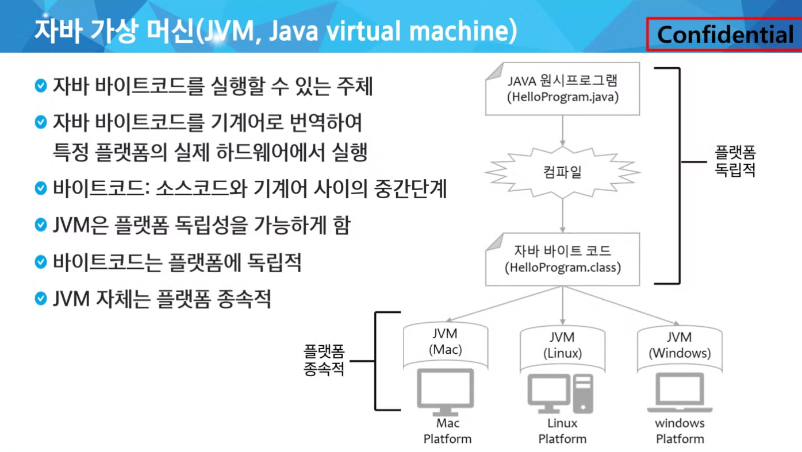
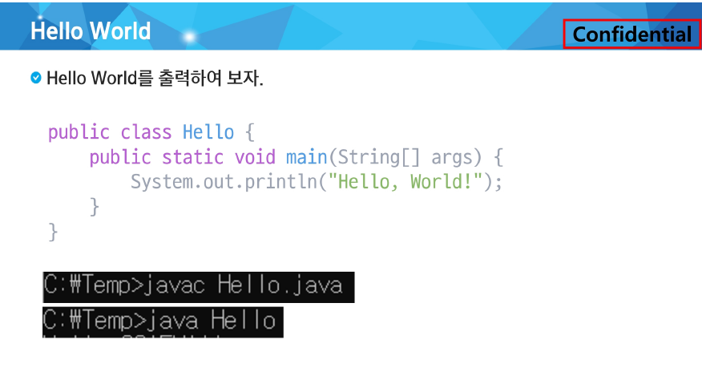

# JAVA 기본문법 제어문

- 프로그램이란

컴퓨터가 특정 작업을 수행하도록 지시하는 일련의 명령어들의 집합(작업지침서)

컴퓨터가 이해할 수 있는 형태(기계어)로 작성된 명령어의 집합(실제로는 기계어로 실행됨)

명령은 CPU에서 실행됨

ex) 응용프로그램, 운영체제(윈도우, 맥, 리눅스, IOS, 안드로이드 등)

- 운영체제란

시스템 하드웨어를 관리할 뿐 아니라 응용 프로그램을 실행하기 위하여 하드웨어 추상화 플랫폼과 공통 시스템 서비스를 제공하는 시스템 소프트웨어

- 컴퓨터의 자료표현

비트: binary digit의 줄임말, 0또는 1의값만 가질 수 있음

바이트: 8개의 비트로 구성된 정보 단위, 컴퓨터 메모리의 기본 단위

ex)32비트 컴퓨터는 2^32가지의 정보를 저장가능, 그래서 메모리제한 4GB

2진수: 두가지상태만을 사용하는 수체계

자바를 배우기위해 가장 기본적으로 알아야하는게 JVM

컴파일이란 단어는 C나C++에서도 적용되는 단어, 코드는 기계어로 변환하고 실행하는데 이 변환과정을 컴파일이라 함, 

자바에서는 똑같이 컴파일과정을 거치는데 기계어로 바뀌는게 아닌 자바 바이트코드로 바뀜(여러 환경에서도 작동할 수 있도록 하기위해), JVM을 통역사라고 생각하면 편함

sts에서는 되는데 cmd에서는 안되네… 왤까..

윗줄이 컴파일 하는것이고 아랫줄이 실행하는것임(JVM이 실행)

인간이 보기위해서 주석을 달음, 자바에서는 위에보이는 것 처럼 3가지

세 번째 Documentation API앞 *은 이뻐보일라고 한 것임

일반 줄 주석처리는 파이썬이랑 단축키 같음

일반 print 매서드에서는 print(”Hello World\n)이런식으로 줄바꿈을 함, 파이썬에서는 print함수의 end=’\n’이 디폴트값인 것 

중간에 \를 출력하고싶다면 printIn(”\””) 이런형태 참고

printf(”%d\n”, 10) 이런형태로 씀

실수는 %.2f\n 이런식으로 쓴다면 자동반올림

파이썬과 같은논리로 이해, 할당은 대입과 같은말

읽어보기

외우는거 아님 자바에서 알아서 보라색으로 출력될 것

자바는 데이터가 정적데이터임, 그래서 타입을 꼭 정해줘야함

참조자료는 장소를 기록하고있다. 기본값은 null임(아무것도 참조하지 않음)

문자형은 양수의 형태를 지니고있다.

int범위는 -21억부터 21억까지다, long은 -10^19부터 10^19까지다 라고알기

정수는 int, 실수는 double을 기본으로 함

float는 10^38, double은 10^308

age는 정수니까 기본자료형, 철수는 참조자료형

기본자료형은 값이 그대로 들어가는 반면 참조자료형은 주소를 가리킴

변수를 선언만하고 출력하면 오류임, 초기화까지 해줘야함

묵시적 형변환은 작은집에서 큰집으로 이사간다고 생각

명시적은 반대로, 그렇다면 문제가 생길 수 있음, 그문제를 형변환 연산자를 사용하여 해결한다. 

위 그림은 외울 것

- 리터럴개념

값을 소스코드상에 적어 놓은 것, 데이터형에 따라서 값의 표기 방법이 다르다.

ex) 100 → int형의 숫자 100, 

100L → long형의 숫자 100

12.321 → double 형

12.321f → float형

“Hello” → string형의 문자열

long n3 = 100; 꼴로 선언하면 사실 이건 이미 묵시적 형변환이 일어나고 있었음

외우는거 아니야~ 너무많아

피연산자 1개인게 단항연산자 int a= 10; a—; a++; 이런식

비트부정연산자는 1의보수로 바뀐다고 이해 잘안쓰임

산술연산자는 이항연산, 범위가 큰것으로 통합된다.

나누기같은경우 5/3이면 그냥1, 버림처리, 둘중의 하나만이라도 double로 처리해주면 소수점형태로 결과물이 나오게됨

비교연산자는 불리언값 반환, 

문자열 변수를 비교할때는 참조자료형이기 때문에 
String c = “Hi”;

String e = new String(”Hi”);

이래놓고 c==e 하면 false임, true로 출력하려면 c.equals(e)라는 equals()매서드를 쓰는 것 (문자열 매서드 equals)

객체타입 비교연산은 상속 때 다시하기

읽기

삼항연산자 부분만 봐보자

읽기

둘중에 하나는 무조건 실행됨

파이썬이랑 똑같은논리

if문에서 변수로바뀐것, break만나면 빠져나옴

순서가 매우 중요 1-2-3-4-2-3-4-2-3-4-,,, false가 나오면 종료

파이썬과 동일

일단 한번실행하고 조건본다.

파이썬에서 임의의변수를 불리언으로 선언하고 조건걸어서 중첩반복문 빠져나왔던걸 라벨을 붙여 빠져나올 수 있을 것 같음

out : for문~~ 이런식