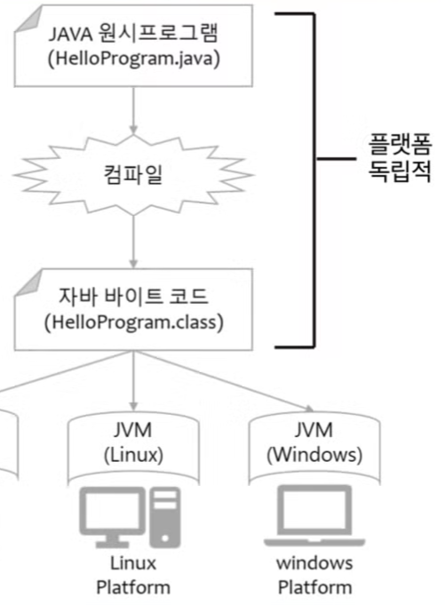
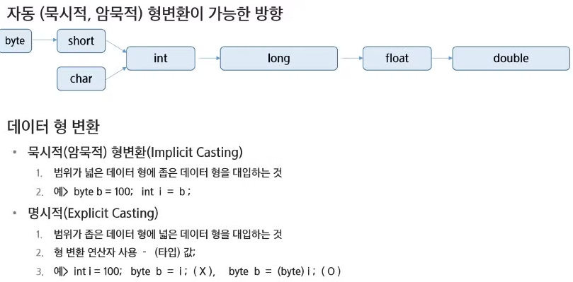

# JAVA(1) 기본문법 제어문

- 프로그램이란

컴퓨터가 특정 작업을 수행하도록 지시하는 일련의 명령어들의 집합(작업지침서)

컴퓨터가 이해할 수 있는 형태(기계어)로 작성된 명령어의 집합(실제로는 기계어로 실행됨)

명령은 CPU에서 실행됨

ex) 응용프로그램, 운영체제(윈도우, 맥, 리눅스, IOS, 안드로이드 등)

- 운영체제란

시스템 하드웨어를 관리할 뿐 아니라 응용 프로그램을 실행하기 위하여 하드웨어 추상화 플랫폼과 공통 시스템 서비스를 제공하는 시스템 소프트웨어

- 컴퓨터의 자료표현

비트: binary digit의 줄임말, 0또는 1의값만 가질 수 있음

바이트: 8개의 비트로 구성된 정보 단위, 컴퓨터 메모리의 기본 단위

ex)32비트 컴퓨터는 2^32가지의 정보를 저장가능, 그래서 메모리제한 4GB

2진수: 두가지상태만을 사용하는 수체계



- 자바가상머신 JVM

자바를 배우기위해 가장 기본적으로 알아야하는게 JVM

자바 바이트코드를 실행할 수 있는 주체

자바 바이트코드를 기계어로 번역하여 특정 플랫폼의 실제 하드웨어에서 실행

바이트코드: 소스코드와 기계어 사이의 중간단계

JVM은 플랫폼의 독립성을 가능하게 함

바이트코드는 플랫폼에 독립적

JVM 자체는 플랫폼 종속적

컴파일이란 단어는 C나C++에서도 적용되는 단어, 코드는 기계어로 변환하고 실행하는데 이 변환과정을 컴파일이라 함, 

자바에서는 똑같이 컴파일과정을 거치는데 기계어로 바뀌는게 아닌 자바 바이트코드로 바뀜(여러 환경에서도 작동할 수 있도록 하기위해), JVM을 통역사라고 생각하면 편함

- Hello World 출력

```java
package java01_intro;

public class Intro01_Hello {
	// 자동완성을 적극적으로 활용!!
	// ctrl + spacebar
	// main + ctrl + spacebar
	public static void main(String[] args) {
		
		// sysout + ctrl + spacebar
		System.out.println("Hello, World!!!");
	}

}

```

- 자바 애플리케이션의 시작점

자바 어플을 실행할 때 가장 먼저 호출되는 것

자바 어플에  main() 메서드가 없다면 절대 실행될 수 없다. 형태는 고정된 형태

```java
public static void main(String[] args) {   
	// ... 함수의 본문 ...
}
```

- 주석

인간이 보기위해서 주석을 달음

방법1. // 내용: 한줄 주석

방법2. /* 내용 */ : 여러줄 주석

방법3. /** 내용 */ : 문서화주석, Documentation API를 위한 주석처리

세 번째 Documentation API앞 *은 이뻐 보일라고 한 것임

일반 줄 주석처리는 파이썬이랑 단축키 같음

```java
package java01_intro;

/**
 * 문서화 주석입니다.
 */
public class Intro02_Comment {
    
    public static void main(String[] args) {       
        // 기호가 등장한 순간부터 끝까지 해당 줄을 주석 처리 
        System.out.println("Hello"); // 이후부터 주석
        
        /*
         여러 줄
         주석입니다.
         */
        
        /*
         * 해당 범위를 주석 처리하겠다.
         */
        
        /**
         * Documentation API를 위한 주석처리
         */
    }
}

```

- 출력하는 법

일반 print 매서드에서는 print(”Hello World\n)이런식으로 줄바꿈을 함, 

파이썬에서는 print함수의 end=’\n’이 디폴트값인 것 

중간에 \를 출력하고싶다면 printIn(”\””) 이런형태 참고

printf(”%d\n”, 10) 이런형태로 씀

실수는 %.2f\n 이런식으로 쓴다면 자동반올림

```java
package java01_intro;

public class Intro03_PrintTest {
    public static void main(String[] args) {
        
        //print를 써보자
        System.out.print("Hello World\n");
        
        // 주석 처리 :  ctrl + /
//        // \n을 사용하면 줄이 바뀐다.
        System.out.println("Hello World!!!");
        System.out.println("Hello World!!!");
//        
        System.out.println("\\");
        System.out.println("\"");
//        
        // printf : 포맷지정자 <= 어떤 값이 들어갈자리.
        System.out.printf("%d\n", 10); // 정수 (10진수)
        System.out.printf("%o\n", 10); // 정수 (8진수)
        System.out.printf("%x\n", 10); // 정수 (16진수) 소문자 
        System.out.printf("%X\n", 10); // 정수 (16진수) 대문자 
//        
        System.out.printf("%4d\n", 10); // 4칸을 확보한 뒤 오른쪽부터 차지 
        System.out.printf("%-4daaa\n", 10); // 4칸을 확보한 뒤 왼쪽부터 차지 
        System.out.printf("%04d\n", 10); // 4칸을 확보한 뒤 오른쪽부터 차지 (빈칸은 0으로 채움)
//        
        System.out.printf("%f\n", 10.12345); // 실수
        System.out.printf("%.2f\n", 10.12545); // 실수 (소수점 둘째자리까지 반올림해서 출력.)
//        
        System.out.printf("%s\n", "싸피"); // 문자열
        System.out.printf("%c\n", 'A'); // 문자 
        System.out.printf("%d\n", (int)'A'); // 문자를 정수로 출력
        
        
    }
}

```

- 변수

파이썬과 같은논리로 이해, 할당은 대입과 같은말

변수 데이터 저장을 위해 메모리의 특정 위치를 가리키는 이름

변수를 선언하면 저장할 데이터 타입에 따라 적정한 크기의 메모리 공간을 확보한다.

변수를 통해 메모리 상의 데이터를 읽고 쓸 수 있다.

메모리의 기본단위는 1 byte, 바이트마다 주소가 있음

변수이름 규칙은 파이썬이랑 비슷하니 보편적으로 이해, 한글도 작성이 가능하나 권장하진 않는다.

만약 자바 예약어를 변수명으로 쓴다면 보라색으로 출력 될 것

- 자료형(데이터 타입, Data Type)

자바는 데이터가 정적 데이터이다. 그래서 타입을 꼭 정해줘야함

참조자료는 장소를 기록하고있다. 기본값은 null임(아무것도 참조하지 않음)

문자형은 양수의 형태를 지니고있다.

int범위는 -21억부터 21억까지다, long은 -10^19부터 10^19까지다 라고알기

정수는 int, 실수는 double을 기본으로 함

float는 10^38, double은 10^308

| 타입 | 세부타입 | 데이터형 | 크기 | 기본값 | 값의 범위 |
| --- | --- | --- | --- | --- | --- |
| 논리형 |  | boolean |  | false | true / false |
| 문자형 |  | char | 2byte | null | 0~65,535 |
| 숫자형 | 정수형 | byte | 1byte | (byte)0 | -128~127 |
|  |  | short | 2byte | (short)0 | -32768~32767 |
|  |  | int | 4byte | 0 | -21억 ~ 21억 |
|  |  | long | 8byte | 0L | -10^19 ~ 10^19 |
|  | 실수형 | float | 4byte | 0.0f | 10^38 |
|  |  | double | 8byte | 0.0d | 10^308 |
- 자료형 선언
1. 선언

자료형 변수명;

ex) int age; String name;

1. 저장(할당)

변수명 = 저장할 값;

age = 30; name=”철수”;

1. 초기화

자료형 변수명 = 저장할 값;

int age = 30;

age는 정수니까 기본자료형, 철수는 참조자료형

기본자료형은 값이 그대로 들어가는 반면 참조자료형은 주소를 가리킴

변수를 선언만하고 출력하면 오류임, 초기화까지 해줘야함

```java
package java02_variable;

public class Var01_VariableTest {
    public static void main(String[] args) {
        // 변수 작명규칙 
        // - 대소문자를 구분한다 
        // - 공백은 허용되지 않는다 
        // - 숫자로 시작할 수 없다.
        // - '$'와 '_'를 변수 이름에 사용할 수 있다. 이외의 특수문자는 허용되지 않는다.
        // - 예약어(keyword : 자바 문법을 위해서 미리 지정되어 있는 단어)는 사용할 수 없다.
        // - 합성어의 경우 주로 camelCase를 활용한다.
        // - 한글을 이용한 변수 작명 가능(권장 X)       
         
        
        // 변수 선언 
    	// 자료형 변수이름;
        int age;
        int _age;
        int $age$;
        
        // 변수 초기화
        // 자료형 변수이름 = 초기값;
        int money = 10000;
        
        // 변수를 선언만하고 출력할 수 있을까? 못함
        int a;
//         System.out.println(a);
        
    }
}
```

- 형변환



묵시적 형변환은 작은집에서 큰집으로 이사간다고 생각

명시적은 큰집에서 작은 집으로,

그렇다면 문제가 생길 수 있음, 그문제를 형변환 연산자를 사용하여 해결한다. 

```java
package java02_variable;

public class Var02_TypeCasting {
    public static void main(String[] args) {
        
    	// 형변환: 자료형을 바꾸는 것
    	
    	// 1. 묵시적 형변환
    	//   - 범위가 작은 자료형 -> 범위가 큰 자료형으로 이사
    	int n1 = 100; // 주의할점: 값이 아니라 데이터 형에 주목.
    	long n2 = n1; // 묵시적 형변환.
    	
    	
    	// 2. 명시적 형변환
        //    - 범위가 큰 자료형 -> 범위가 작은 자료형으로 이사
    	//    - 기본적으로 에러가 남. 안됨.
    	//    - 프로그래머가 명시적으로 바꿔줘야 함.
    	//    - 형변환 연산자 사용 : (바꾸고싶은자료형)
    	long n3 = 100; // 묵시적 형변환이 일어나고 있었음.
    	int n4 = (int) n3;
    	
    	
    	// 리터럴
    	// - 값을 소스코드상에 적어 놓은 것.
    	// - 데이터형에 따라서 값의 표기 방법이 다르다.
    	// - 100 => int형의 숫자 100
    	// - 100L => long형의 숫자 100
    	// - 12.321 => double형
    	// - 12.321f => float형
    	// - "Hello, World!" => String형의 문자열.
    	
    	int n5 = (int) 12345678901234L;
    	long n6 = 12345678901234L;
    	
    	
        
    }
}
```

- 리터럴개념

값을 소스코드상에 적어 놓은 것, 데이터형에 따라서 값의 표기 방법이 다르다.

ex) 100 → int형의 숫자 100, 

100L → long형의 숫자 100

12.321 → double 형

12.321f → float형

“Hello” → string형의 문자열

long n3 = 100; 꼴로 선언하면 사실 이건 이미 묵시적 형변환이 일어나고 있었음 ( long n3 = (int) 100; )

- 연산자
1. 단항 연산자

피연산자 1개인게 단항연산자

int a= 10; 

a—; a++; 이런 식

증감연산자 ++, —

전위형 ++i : 값을 먼저 증감시킨 후 사용

후위형 i++ : 값을 먼저 사용한 후 증감

부호, 논리, 비트연산자는 파이썬이랑 같음,

비트부정연산자는 1의보수로 바뀐다고 이해 (잘 안쓰임)

형변환 연산자 : type

```java
package java03_operator;

public class Op01_단항연산자 {

    public static void main(String[] args) {
       // 다음 중 올바른 값을 채워 넣으시오.
        int a = 5;
        System.out.println(a++); // 5 : 후위형: 먼저 값을 출력한 다음 증감시킨다.
        // a는 현재 6이라는 값을 가지고 있음.
        System.out.println(++a); // 7 : 전위형: 먼저 값을 증감시킨다음 출력한다.
        System.out.println(--a); // 6 
        System.out.println(a); // 6
        System.out.println(a--); // 6
        System.out.println(a++); // 5
        
        System.out.println(-a); // -6 : 음수 -> 양수, 양수 -> 음수
        System.out.println(~a); // -7 : 1의 보수로 바뀜 
//        
        System.out.println(!false); // true : 논리 반전 f ->t , t -> f
        
    }
    
}
```

1. 산술 연산자

산술연산자는 이항연산, 범위가 큰것으로 통합된다.

나누기같은경우 5/3이면 그냥1, 버림처리, 둘중의 하나만이라도 double로 처리해주면 소수점형태로 결과물이 나오게됨

정수와 정수의 연산 = 정수

정수와 실수의 연산 = 실수

```java
package java03_operator;

public class Op02_산술연산자 {
    public static void main(String[] args) {
        int a = 10;
        int b = 6;
        
        System.out.println(a + b); // 16
        System.out.println(a - b); // 4 
        System.out.println(a * b); // 60
        System.out.println(a / b); // 1 : 둘다 정수형이기 때문에 정수형으로 출력이 된다.(소수점 이하는 버림처리)
        System.out.println(a % b); // 4
        
        // 둘중에 하나라도 실수로 바꾸면, => 실수로 통일해서 연산을 할 것이므로
        // 실수의 형태로 결과물이 나오게 된다.
        System.out.println((double)a / b);
        System.out.println(a / (double)b);
        System.out.println((double)(a / b));
        
        System.out.println(13.4f / 20L);
//        
        double c = 2.3;
//        
        System.out.println(a / c);
        System.out.println(a / (int) c);
        
        // 둘 다 정수 => 계산 결과도 정수 (소수점 이하 버림) 
        // 둘 중 하나라도 실수 => 계산 결과는 실수
        
    }
}
```

1. 비교 연산자

비교연산자는 불리언값 반환, 

문자열 변수를 비교할때는 참조자료형이기 때문에 
String c = “Hi”;

String e = new String(”Hi”);

이래놓고 c==e 하면 false임, 

true로 출력하려면 c.equals(e)라는 equals()매서드를 쓰는 것 (문자열 매서드 equals)

객체타입 비교연산은 상속 때 다시하기

```java
package java03_operator;

public class Op03_비교연산자 {

    public static void main(String[] args) {
        int a = 10;
        
//        System.out.println(a > 10); // f
//        System.out.println(a <= 10); // t
//        System.out.println(a >= 10); // t
//        System.out.println(a == 10); // t
//        System.out.println(a != 10); // f
        
        // 문자열은 어떻게 비교하는가?
        String c = "Hi";
        String d = "Hi";
        String e = new String("Hi");
        
        System.out.println(c == d); // t
        System.out.println(c == e); // f : 참조값(주소값)이 다르기 때문에
        System.out.println(c.equals(e)); // t : 우리가 원하는 것은 주소 비교가 아니라 값 비교.
        // 값 비교를 할 때는 equals를 쓴다.
        System.out.println(d.equals(e));
        
    }
}
```

1. 논리 연산자

```java
package java03_operator;

public class Op04_논리연산자 {
    public static void main(String[] args) {
        
//        System.out.println(true && true);
//        System.out.println(true && false);
//        System.out.println(false && true);
//        System.out.println(false && false);
//        
//        System.out.println(true || true);
//        System.out.println(true || false);
//        System.out.println(false || true);
//        System.out.println(false || false);
        
        int a = 10;
        int b = 20;
        // 기본
        
        System.out.println(a > b && a++ > b); // short circuit 발생(하나만 확인)
        System.out.println(a);
        System.out.println(a < b && a++ < b); // 둘다 확인 
        System.out.println(a);
        
        System.out.println(a > b || a++ > b); // 둘다 확인 
        System.out.println(a);
        System.out.println(a < b || a++ < b); // short circuit 발생 (앞에거 하나만 확인)
        System.out.println(a);
        
        
//        System.out.println("-----");
//        
//        a = 10;
//        b = 20;
//        
//        System.out.println(a > b & a++ > b); // 둘다 확인
//        System.out.println(a);
//        System.out.println(a < b & a++ < b); // 둘다 확인 
//        System.out.println(a);
//        
//        System.out.println(a > b | a++ > b); // 둘다 확인 
//        System.out.println(a);
//        System.out.println(a < b | a++ < b); // 둘다 확인
//        System.out.println(a);

    }
}
```

1. 삼항 연산자

```java
package java03_operator;

public class Op05_삼항연산자 {
    public static void main(String[] args) {
        // 삼항연산자
        // 조건식? 식1(참) : 식2(거짓)
        
        //랜덤 숫자 발생기 
        int num = (int) (Math.random() * 10) + 1;
        
        // 0<=   <1
        // 0<=   <10
        // 0<=   <=9
        // 1<=   <=10
        
        // num이 홀수인지 짝수인지.
        System.out.println(num);
        System.out.println(num % 2 == 0 ? "짝" : "홀");
    }
}
```

- 제어문

프로그램의 흐름을 제어하는 문법 요소

조건문: if, switch

반복문: for, while, do-while

점프문: break, continue, return

예외처리문: try, catch, finally, throw, throws

1. if문

```java
package java04_control;

public class Ctrl01_If {
    public static void main(String[] args) {
        // if(조건식) { } 조건식이 참일 경우 블록 내부 수행
        // 조건식: boolean 형태의 값을 봔환하는 식이나, boolean 값이 들어감
        // 수행할 문장이 한 문장이라면 중괄호 생략 가능
        
        int n = 15;
        if(n > 10) {
            System.out.println("블록 내부를 수행한다.");
        }
        
        if(n > 10)
            System.out.println("해당 문장을 수행한다.");
            System.out.println("얘도 수행?"); // 이 문장은 조건문과 관련이 없다.
    }
}
```

1. if-else문

```java
package java04_control;

public class Ctrl02_If_Else {
    public static void main(String[] args) {
        // if(조건식) { } 조건식이 참일 경우 if 블록 내부 수행
        // else { } 조건식이 거짓인 경우 else 블록 내부 수행 
        
        // 무슨 음료를 마실 수 있는가?
        int age = 17;
        
        if(age < 20){
            System.out.println("사이다만 마실 수 있다.");
        } else {
           System.out.println("맥주를 마실 수 있다.");
        }
        
        // ㅇㅇ랜드 입장권 가격은??
        int price;
        if( age < 20)
            price = 20000;
        else
            price = 50000;
        
        System.out.println(price);
    }
}

```

1. switch문

if문에서 변수로바뀐것, break만나면 빠져나옴

```java
package java04_control;

public class Ctrl04_Switch {
    
    public static void main(String[] args) {
        int month = 12;
        // switch 문에는 변수 또는 값으로 평가되는 식을 집어넣는다.
        switch(month) {
        case 1:
        case 3:
        case 5:
        case 7:
        case 8:
        case 10:
        case 12:
            System.out.println("31일 ");
            break;
        case 4:
        case 6:
        case 9:
        case 11:
            System.out.println("30일 ");
            break;
        case 2:
            // 4로 나누어 떨어지는 해는 윤년이다.
            // 4, 100으로 나누어 떨어지는 해는 평년이다.
            // 4, 100, 400으로 나누어 떨어지는 해는 윤년이다.
            System.out.println("28일. 윤년 고려해봐야함.");
            break;
        default:
             System.out.println("그런 월은 존재하지 않음.");
        }
    }
    
}
```

1. for문

순서가 매우 중요 1-2-3-4-2-3-4-2-3-4-,,, false가 나오면 종료

```java
package java05_loop;

public class Loop01_for {
    public static void main(String[] args) {
        // for (초기화; 조건식; 증감식) { 반복 내용}
        // 조건식을 비워두면 항상 참으로 인식해서 끝나지 않음
        // 반복 횟수를 알고 있을 때 사용하면 좋다. 
        
        for (int i=0; i< 5; i++) {
            System.out.println(i);
        }
        
        for(int i = 0, j = 30; i < 10 && j >= 20; i+=10, j+=2) {
            System.out.println(i + " " + j);
        }
        
        // 중첩 반복문 (구구단)
        
        for (int i=2; i<=9; i++) {
            System.out.println(i+"단");
            for(int j=1; j<=9; j++) {
                System.out.printf("%d * %d = %d\n", i, j, i*j);
            }
        }
    }
}

```

1. while 문

파이썬과 논리가 동일함

```java
package java05_loop;

public class Loop02_while {
    public static void main(String[] args) {
        // while(조건식) { 반복내용}
        // 조건식 생략 불가능
        
        
        int n = 10;
        
        // 조건식이 위배가 되게끔 증감을 결정해야 한다.
        while(n > 5) {
            System.out.println("이거 실행되나? "+n);
            n--;
        }
    }
}

```

1. do-while문

일단 한번실행하고 조건본다.

```java
package java05_loop;

import java.util.Scanner;

public class Loop03_do_while {
    public static void main(String[] args) {
        // do {
        // 실행 문장
        // } while(조건식);
        // 무조건 한번은 수행하고 조건식 판별하므로 
        // 최소 한 번은 실행.
        
        Scanner sc = new Scanner(System.in);
        int num;
        
        do {
            System.out.println("숫자를 입력하세요. (0이면 종료)");
            num = sc.nextInt();
        } while(num != 0);
        
    }
}
```

1. break, continue, return문

파이썬에서 임의의변수를 불리언으로 선언하고 조건걸어서 중첩반복문 빠져나왔던걸 라벨을 붙여 빠져나올 수 있을 것 같음

out : for문~~ 이런식

```java
package java05_loop;

public class Loop04_break_continue {
    public static void main(String[] args) {
        // break : 가까이 있는 반복문을 종료
        // continue: 남아있는 구문을 수행하지 않고 다음 반복으로 이동

        // 다음은 무슨 의미? (짝수 단만 출력하겠다)
        for (int i = 2; i <= 9; i++) {
            if (i % 2 == 1)
                continue;
            System.out.println(i + "단");
            for (int j = 1; j <= 9; j++) {
                System.out.printf("%d * %d = %d\n", i, j, i * j);
            }
        }

//        // 다음은 무슨 의미? (5단까지만 출력하겠다)
//        for (int i = 2; i <= 9; i++) {
//            if (i > 5)
//                break;
//            System.out.println(i + "단");
//            for (int j = 1; j <= 9; j++) {
//                System.out.printf("%d * %d = %d\n", i, j, i * j);
//            }
//        }
//
//        // 다음은 무슨 의미? (각 단의 5번째 줄까지 출력하겠다)
//        for (int i = 2; i <= 9; i++) {
//            System.out.println(i + "단");
//            for (int j = 1; j <= 9; j++) {
//                if (j > 5)
//                    break;
//                System.out.printf("%d * %d = %d\n", i, j, i * j);
//            }
//        }
//
//        // 다음은 무슨 의미? (2단의 5번째 줄까지 출력하고 멈춤)
//        out: for (int i = 2; i <= 9; i++) {
//            System.out.println(i + "단");
//            for (int j = 1; j <= 9; j++) {
//                if (j > 5)
//                    break out;
//                System.out.printf("%d * %d = %d\n", i, j, i * j);
//            }
//        }
//        
//        // 다음은 무슨 의미? (2단의 5번째 줄까지 출력하고 멈춤)
//        out: for (int i = 2; i <= 9; i++) {
//            System.out.println(i + "단");
//            for (int j = 1; j <= 9; j++) {
//                if (j > 5)
//                   continue out;
//                System.out.printf("%d * %d = %d\n", i, j, i * j);
//            }
//        }
//        
    }
}

```