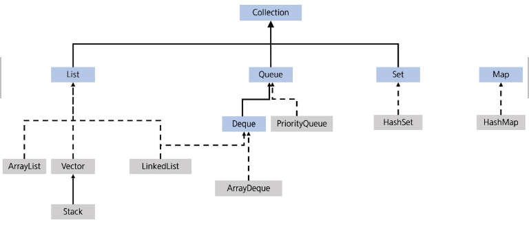

# JAVA(8) 컬렉션프레임워크

## 컬렉션 프레임워크

- 자료구조
    - 데이터에 효율적으로 접근하기 위해 선택되는 데이터의 조직 및 저장 형식
    - 데이터값들의 모음, 이들 간의 관계, 데이터에 적용될 수 있는 연산의 모음
- 자료 구조의 분류
    - 정적 자료구조(Static Data Structure): 크기가 고정된 자료 구조(예: 배열)
    - 동적 자료구조(Dynamic Data Structure): 크기가 변할 수 있는 자료 구조 (예: 리스트, 스택, 큐)
- 자료 구조의 선택 기준
    - 데이터 접근 속도
    - 메모리 사용 효율성
    - 삽입 및 삭제의 효율성
    - 순서 유지 여부
    - 중복 데이터 허용 여부
- 자바의 컬렉션 프레임워크
    - 다양한 자료 구조를 구현하여 제공
    - 개발자가 다양한 상황에 맞게 적절한 자료구조를 선택할 수 있음
    - 구성요소: 주요 인터페이스, 구현 클래스, 유틸리티 클래스로 구성
- 주요 인터페이스
    - Collection: list, set, queue 등 컬렉션의 상위 인터페이스
    - list: 순서가 있는 컬렉션, 중복을 허용
    - set: 중복을 허용하지 않는 컬렉션
    - Queue: FIFO방식의 컬렉션
    - Deque: 양쪽 끝에서 요소의 삽입/삭제가 가능한 컬렉션
    - Map<K,V>: 키-값 쌍으로 이뤄진 요소의 컬렉션
- 주요 구현 클래스
    - ArrayList: 동적 배열로 구현된 list(사실은 배열을 계속 새로 만드는 것)
    - LinkedList: 이중 연결 리스트로 구현된 list와 Deque
    - stack: LIFO방식의 컬렉션
    - HashSet: 해시 테이블 기반의 set
    - PriorityQueue: 힙 기반의 우선순위 큐
- 유틸리티 클래스
    - Collections: 컬렉션 객체의 정렬, 검색 등을 위한 정적 메서드 제공
    - Arrays: 배열을 다루기 위한 유틸리티 메서드 제공
- Collection 프레임워크 계층도



- Collection 인터페이스
    - list, set, queue의 상위 인터페이스

| 메서드 | 설명 |
| --- | --- |
| boolean add(E e) | 컬렉션에 요소를 추가
요소가 성공적으로 추가되면 true를 반환하고, 그렇지 않으면 false를 반환 |
| boolean remove(Object o) | 컬렉션에서 지정된 요소를 제거
요소가 성공적으로 추가되면 true를 반환하고, 그렇지 않으면 false를 반환 |
| boolean contains(Object o) | 컬렉션에 지정된 요소가 있는지 확인
포함되어 있으면 true, 아니면 false |
| int size() | 컬렉션의 요소 개수를 반환 |
| void clear() | 컬렉션의 모든 요소를 제거 |
| Iterator<E> iterator() | 컬렉션의 요소들을 반복할 수 있는 Iterator 객체를 반환 |
| Object[] toArray() | 컬렉션의 모든 요소를 포함하는 배열을 반환 |

### List

- 순서가 있고, 중복을 허용(배열과 유사)
- 구현 클래스
    - ArrayList
    - LinkedList
    - Vector
- 내부적으로 배열을 이용하여 데이터를 관리
- 배열과 다르게 크기가 유동적으로 변함 (동적 자료구조)
- 배열을 다루는 것과 유사하게 사용할 수 있음
- 주요 메서드

| 분류 | Collection | List |
| --- | --- | --- |
| 추가 | add(E e),
addAll(Collection<? extends E>c) | add(int index, E element),
addAll(int index, Collection<? extends E>c) |
| 조회 | contatins(Object o),
containsAll(Collection<?> c),
equals(),
isEmpty(),
iterator(),
size(), | get(int index),
indexOf(Object o),
lastIndexOf(Object o),
listIterator(), |
| 삭제 | clear(),
removeAll(Collection<?> c)
retainAll(Collection<?> c), | remove(int index) |
| 수정 |  | set(int index, E element) |
| 기타 | toArray() | subList(int fromIndex, int toIndex) |

```java
// 문자열을 저장할 List, 구현체는 ArrayList
List<String> names = new ArrayList<>();

//추가
names.add("양만춘");
names.add("홍길동");
names.add("양만춘");
names.add("이순신");
names.add(0, "임꺽정");
System.out.printIn(names);
```

- Array
    - 같은 타입의 데이터를 묶어 사용하는 자료구조
    - 접근 속도가 빠름 → 효율적
    - 크기를 변경할 수 없어 추가 데이터를 넣을 때, 새로운 배열을 만들고 복사함.
    - 데이터 삭제 시, 인덱스를 재조정하기 위해 전체 데이터를 옮겨야 함 → 비효율적
    - ArrayList 역시 Array를 활용하므로 이 같은 특징을 가지고 있음
- ArrayList
    - add(E e): 데이터 입력
    - get(int index): 데이터 추출
    - size(): 입력된 데이터의 크기 반환
    - remove(int i): 특정한 데이터를 삭제
    - remove(Object o): 특정한 데이터를 삭제
    - clear(): 모든 데이터 삭제
    - contains(Object o): 특정 객체가 포함되어 있는지 체크
    - isEmpty(): 비어 있는지 체크(true, false)
    - addAll(Collection c): 기존 등록된 Collection 데이터 입력
    - iterator(): iterator 인터페이스 객체 반환
- LinkedList
    - 각 요소를 Node로 정의하고 Node는 다음 요소의 참조 값과 데이터로 구성됨
    - 각 요소가 다음 요소의 링크 정보를 가지며 연속적으로 구성될 필요가 없음

### Set

- 특징: 순서가 없고, 중복을 허용하지 않음
- 장점: 빠른 속도, 효율적인 중복 데이터 제거 수단
- 단점: 단순 집합의 개념으로 정렬하려면 별도의 처리가 필요함
- 구현클래스
    - HashSet
    - TreeSet
- add(E e): 데이터 입력
- size(): 입력된 데이터의 크기 반환
- remove(Object o): 특정한 데이터를 삭제
- clear(): 모든 데이터를 삭제
- contains(Object o): 특정 객체가 포함되어 있는지 체크
- isEmpty(): 비어 있는지 체크(true, false)
- iterator(): iterator 인터페이스 객체 반환
- toArray(): Set의 내용을 Object 형의 배열로 변환

### Map

- 특징: Key와 value를 하나의 Entry로 묶어서 데이터 관리, 순서는 없으며 키에대한 중복은 없음
- 장점: 빠른 속도
- 구현클래스
    - HashMap
    - TreeMap
- V put(K key, V value): 데이터 입력
- V get(Object key): 데이터 추출
- V remove(K key): 키의 값을 지우고 반환, 없다면 null 반환
- boolean containsKey(Object key): 특정한 key 포함 여부
- void putAll(Map<K key, V value> m): 기존 Collection 데이터 추가
- Set<Map.Entry<K,V>> entrySet():
    - (key와 value) 쌍을 표현하는 Map.Entry 집합을 반환

### Queue

- Queue는 인터페이스, 구현체는 LinkedList를 사용
- 큐 자료구조: FIFO
- boolean offer(E e): 데이터를 추가
- E peek(): 가장 앞 데이터 조회
- E poll(): 가장 앞 데이터 빼내기
- boolean isEmpty(): 큐가 비어있는지 여부

### Stack

- Stack 클래스를 사용
- 스택 자료구조: LIFO
- E push(E e): 데이터를 추가
- E peek(): 가장 위 데이터 조회
- E pop(): 가장 위 데이터 빼내기
- boolean isEmpty(): 스택이 비어있는지 여부

### Deque

- Deque은 인터페이스, 구현체는 ArrayDeque, LinkedList를 사용
- 양쪽 끝에서 자유롭게 원소의 추가, 삭제 가능
- addFirst(E e): 맨 앞에 데이터를 추가
- addLast(E e): 맨 뒤에 데이터를 추가
- E removeFirst(): 가장 앞 데이터 제거
- E removeLast(): 가장 뒤 데이터 제거
- E peekFirst(): 가장 앞 데이터 조회
- E peekLast(): 가장 뒤 데이터 조회
- boolean isEmpty(): 덱이 비어있는지 여부 검사

## Sort

- 요소들을 특정 기준에 맞추어 오름차순 또는 내림차순으로 배치 하는 것
- 순서를 가지는 Collection들만 정렬 가능
- Collections의 sort()를 이용한 정렬

### Comparable interface

```java
public interface Comparable<T> {
	public int compareTo(T o);
}
// 양수: 자리바꿈
// 음수: 자리유지
// 0: 동일 위치
```

### Comparator의 활용(자세한 것은 실습코드 참고)

- 객체가 Comparable을 구현하고 있지 않거나 사용자 정의 알고리즘으로 정렬하려는 경우
    - String을 알파벳 순이 아니라 글자 수 별로 정렬을 하고 싶다
    - sort(List<T> list, Comparator<? Super T> c)
    - 1회성 객체 사용 시 anonymous inner class 사용
    - 클래스 정의, 객체 생성을 한번에 처리
    - 람다 표현식 사용