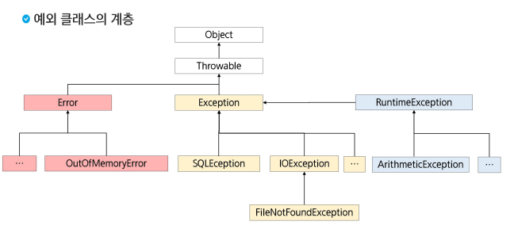

# JAVA(9) 예외처리(Exception Handling)

### 프로그램의 오류(에러, Error)

- 어떤 원인에 의해 오동작 하거나 비정상적으로 종료되는 경우

### 발생 시점에 따른 구분

- 컴파일 에러(compile-time error): 컴파일 도중 컴파일러가 발견하는 오류(문법적 오류)
- 런타임 에러(runtime error): 컴파일은 성공적으로 진행되었으나, 프로그램 실행 중에 발생하는 오류(문법은 ok, 비정상적으로 종료)
- 논리적 에러(logical error): 컴파일도 되고 프로그램도 실행되었으나, 프로그램이 의도대로 동작하지 않는 오류. 프로그램이 정상적으로 실행되고 종료되었지만 결과가 예상과 다른 경우

### 에러와 예외(명확한 구분)

- 에러(Error): 발생하면 복구할 수 없는 심각한 오류
    - An Error is a subclass of Throwable that indicates serious problems that a reasonable application should not try to catch
    - 메모리 부족
    - 스택 오버 플로우
    - etc
- 예외(Exception): 프로그래머가 적절한 코드를 통해 대비할 수 있는 오류
    - An exception(exceptional event) is an event, which occurs during the execution of a program, that disrupts the normal flow of the program’s instructions
    - 클래스 형 변환 실패
    - 파일 읽기 실패
    - etc
- 예외처리
    - 예외 발생 시 프로그램의 비정상 종료를 막고 정상적인 실행 상태를 유지하는 것
    - 예외의 감지 및 예외 발생 시 동작할 코드 작성 필요
- 예외의 종류: 체크예외와 언체크예외
    - 체크예외(Checked Exception): 컴파일 시점에서 예외 처리가 요구되는 예외
        - ex) IOException, SQLException
    - 언체크예외(Unchecked Exception): 실행 시점에서 발생하는 예외로, 컴파일러가 예외 처리를 강제하지 않음
        - ex) NullPointerException, ArrayIndexOutOfBoundsException
- **예외 클래스의 계층**



- 예외 발생 예시
    
    ```java
    package test01_exception;
    public class ExceptionTest {
    	
    	public static void main(String[] args) {
    		
    		// 1. Unchecked Exception
    		//   - RuntimeException의 자손들.
    		//   - 저장하는 순간 => 이클립스에서 컴파일 수행
    		//   - 컴파일 시점에 확인하지 않았다.
    		//   - 컴파일 자체는 완료가 되었다.
    		//   - 일단 실행은 되었음.
    		//   - 컴파일러가 예외 처리를 강제하지 않음.
    		
    		int[] nums = {10};
    		System.out.println(nums[2]);
    		
    		// 2. Checked Exception
    		//   - Exception의 자손 중에서, RuntimeException의 자손은 아닌 애들.
    		//   - 빨간 줄.
    		//   - 저장은 했는데 빨간 줄 => 컴파일 자체가 수행되지 않았다.
    		//   - 실행될 수가 없다.
    		//   - 컴파일러가 예외처리를 강제하고 있다.
    		//   - 예외처리방법은??
    		
    //		Class.forName("Hello"); // 해당하는 이름의 클래스가 있다면,
    		// 메모리에 로드하라.
    		// Thread.sleep(1000); // 일시정지.
    	}
    }
    ```
    
- 예외 처리 키워드
    - 직접 처리
        - try {}: 예외가 발생할 가능성이 있는 코드를 포함하는 블록
        - catch(예외매개변수) {}: 예외가 발생했을 때 실행할 코드 블록
        - finally {}: 예외 발생 여부와 상관없이 항상 실행되는 코드 블록
    - 간접 처리(처리 위임)
        - throws: 메서드 시그니처에 사용되며, 해당 메서드가 특정 예외를 던질 수 있음을 명시
    - 예외를 직접 발생시킬 때
        - throw: 예외를 명시적으로 발생시키는 키워드
- 예외처리(try~catch 구문)
    - 프로그램 실행 시 발생할 수 있는 예외에 대한 대비코드 작성
    - 프로그램의 비정상적인 종료를 막고, 정상적인 상태를 유지할 수 있도록 함
    
    ```java
    try {
    	// (1)예외가 발생할 수 있는 코드
    	// (2)정상코드
    } catch (SomeException e) {
    	// (3)예외가 발생했을 때 처리할 코드
    }
    // (4)일반코드
    ```
    
    - 중괄호 생략 불가능
    - 중첩 된 예외처리: 블록 안에 또 다른 try~catch구문 올 수 있음
    - 예외가 발생할 때:
        - catch 되었을 때 1-3-4
        - catch 안되었을 때 1-종료
    - 예외가 발생하지 않았을 때: 1-2-4
- 다중 예외처리
    - try 블록에서 여러 종류의 예외가 발생
    - 하나의 try 블록에 여러 개의 catch 블록 추가 가능
    
    ```java
    package test02_try_catch;
    
    public class ExceptionTest3 {
    	public static void main(String[] args) {
    		int[] nums = {10};	
    		
    		try {
    			System.out.println("정상 코드 1");
    			System.out.println(nums[0]); // ArrayIndexOutOfBounds..
    			int i = 1 / 0; // Java에서는 숫자를 0으로 나누면 예외 발생 -> ArithmeticException
    			System.out.println("정상 코드 2"); 
    		} catch (ArrayIndexOutOfBoundsException | ArithmeticException e) { 
    			System.out.println("둘 중 한 예외 발생."); 
    		} 
    		System.out.println("프로그램 종료"); 
    	}
    }
    ```
    
- 다중 예외처리 유의사항
    - 예외 객체에 해당하는 catch 문장을 찾을 때는 다형성이 적용
    - 상속 관계에서 상위 타입의 예외가 먼저 선언되는 경우 뒤에 등장하는 catch 블록은 동작할 기회가 없음
    - 상속 관계가 없는 경우는 무관
    - 상속 관계에서는 작은 범위(자식)에서 큰 범위(조상)순으로 정의
    
    ```java
    package test02_try_catch;
    
    public class ExceptionTest4 {
    	public static void main(String[] args) {
    		int[] nums = {10};
    		try {
    			System.out.println("정상 코드 1");
    			System.out.println(nums[0]); // ArrayIndexOutOfBounds..
    			int i = 1 / 0; // Java에서는 숫자를 0으로 나누면 예외 발생 -> ArithmeticException
    			System.out.println("정상 코드 2"); 
    		} catch (ArrayIndexOutOfBoundsException e) { 
    			System.out.println("배열의 인덱스 범위를 벗어났어요."); 
    		} catch (ArithmeticException e) { 
    			System.out.println("잘못된 계산식입니다."); 
    		} catch (Exception e) {
    			System.out.println("모든 예외 처리 가능.");
    		}
    		
    		// 예외도 다형성이 적용되므로
    		// 상속 관계에 있을 때는 자손 먼저~
    		
    //		try {
    //			System.out.println("정상 코드 1");
    //			System.out.println(nums[0]); // ArrayIndexOutOfBounds..
    //			int i = 1 / 0; // Java에서는 숫자를 0으로 나누면 예외 발생 -> ArithmeticException
    //			System.out.println("정상 코드 2"); 
    //		} catch (Exception e) {
    //			System.out.println("모든 예외 처리 가능.");
    //		} catch (ArrayIndexOutOfBoundsException e) { 
    //			System.out.println("배열의 인덱스 범위를 벗어났어요."); 
    //		} catch (ArithmeticException e) { 
    //			System.out.println("잘못된 계산식입니다."); 
    //		} 
    		System.out.println("프로그램 종료"); 
    	}
    }
    ```
    
- Exception 인스턴스의 주요 메서드
    - getMessage(): 발생된 예외에 대한 구체적인 메시지를 반환
    - printStackTrace(): 예외 발생 당시의 호출 스택(Call Stack)을 출력
    
    ```java
    package test02_try_catch;
    
    public class ExceptionTest5 {
    	public static void main(String[] args) {
    		
    		int[] nums = {10};
    	
    		try {
    			System.out.println("정상 코드 1");
    			System.out.println(nums[3]); // ArrayIndexOutOfBounds..
    			int i = 1 / 0; // Java에서는 숫자를 0으로 나누면 예외 발생 -> ArithmeticException
    			System.out.println("정상 코드 2"); 
    		}  catch (Exception e) {
    			System.out.println(e.getMessage());
    			e.printStackTrace();
    			// 모든 예외 메시지를 확인할 수 있으면서도..
    			// 프로그램은 정상 종료되었다.
    			System.out.println("모든 예외 처리 가능.");
    		}
    		System.out.println("프로그램 종료"); 
    	}
    }
    
    ```
    
- 메서드에서 예외 던지기
    - 메서드 선언부에 throws 키워드를 사용하여 예외 작성
    - 예외가 여러 개일 경우 ,를 이용하여 나열
    - 메서드가 예외를 처리하는 것이 아닌 전달
    - 조상 타입의 예외로 처리 가능
- checked exception과 throws
    
    ```java
    package test03_throws;
    public class ThrowsTest1 {
    	// - CheckedException: 컴파일러가 예외 처리를 강제(예외처리 하지 않으면 컴파일 진행x)
    	// - 선택지 2가지: 1. try~catch로 예외처리를 직접 하든지, 2. throws로 전달.
    	// - throws의 의미?
    	// - 1. (메서드를 정의하는 프로그래머) 미안하지만.. 이 메서드에서 처리하지 않을게..
    	//       이 메서드를 사용하는 사람이 예외를 처리해서 쓰도록..(컴파일러가 예외 처리 강제)
    	// - 2. (이 메서드를 사용하는 프로그래머) 이 메서드는 CheckedException을 발생시킬 수 있는 메서드구나..
    	//      내가 이 메서드 쓰려면, 내가 예외 처리해야겠네.
    	// - 3. (컴파일러) CheckedException은 원래 무조건 처리해야되는데.. 메서드 선언에다가 throws를 해놨으니
    	//      한 번만 봐줄게(이 메서드 본문 안에서만 봐줄게), 그런데 이 메서드 호출하는 쪽에서는 얄짤없어.
    	// 프로그램의 시작점인 main 메서드조차 throws 한다면? => 결국에는 예외는 처리되지 않은채 남게된다.
    	// 예외는 처리가 되지 않은 것임!!
    	// 비정상적 종료가 된다.
    	
    	public static void main(String[] args){
    		try {
    			method1();
    		} catch (ClassNotFoundException e) {
    			// TODO Auto-generated catch block
    			e.printStackTrace();
    		}
    	}
    
    	private static void method1() throws ClassNotFoundException  {
    		method2();
    	}
    
    	private static void method2() throws ClassNotFoundException  {
    		Class.forName("Hello"); // CheckedException 발생!
    	}
    }
    ```
    
- runtime exception과 throws

```java
package test03_throws;

public class ThrowsTest2 {
	// UncheckedException과 throws
	// - 컴파일러가 예외처리를 강제 하지 않음.
	// - UncheckedException에게 throws는 아.무.런 의미가 없다.
	//   의미를 찾으려고 하지 말것
	// - throws: 이번만 한 번 봐줄게
	//   UncheckedException: 예외를 처리하든말든 컴파일러가 신경쓰지 않고 원래 봐주는애
	//   예외가 실행중에 발생하면, 프로그래머의 자율에 맡김.
	
	public static void main(String[] args) {
		method1();
	}
	public static void method1() {
		try {
			method2();
		} catch(ArithmeticException e) {
			System.out.println("method 1에서 처리합니다.");
		}
	}
	public static void method2() {
		int i = 1 / 0; // ArithmeticException(UncheckedException)이 발생할 수 있음.
	}
}
```

- 메서드 재정의(override)와 throws
    - 메서드 재정의시 조상클래스 메서드가 던지는 예외보다 부모 예외를 던질 수 없다.

```java
class Parent {
	void methodA() throws IOException {}
	void methodB() throws ClassNotFoundException {}
}

public class Child extends Parent {
	@Override
	void methodA() throws FileNotFoundException {}
	
	// 이렇게는 쓸 수 없음
	@Override
	void methodB() throws Exception {}
```

- finally 구문
    - finally는 예외 발생 여부와 상관 없이 언제나 실행
        
        ```java
        package test04_finally;
        
        public class ExceptionTest1 {
        	public static void main(String[] args) {
        				
        		int[] nums = {10};
        		
        		// try ... catch ... finally
        		// 1. 정상적으로 실행되는 경우: 1 2 4 5
        		// 2. 예외 발생 & 처리가 되는 경우 : 1 3 4 5
        		// 3. 예외 발생 & 처리가 안되는 경우 : 1 4 (비정상적 종료)
        		// 4. 정상 실행 & try문에 return이 있는 경우: 1 2 4
        		// 5. 예외 발생 & 처리 & catch문에 return이 있는 경우 :  1 3 4
        
        		try {
        			System.out.println("1");
        			nums[3] = 40;
        //			int i = 1/1;
        			System.out.println("2");
        //			return; // 메서드를 종료.
        
        		} catch (ArrayIndexOutOfBoundsException e) {
        			System.out.println("3");
        			return;
        		} finally {
        			System.out.println("4");
        		}
        		System.out.println("5"); 
        	}
        }
        // 주석을 풀어보며 실행하기
        ```
        
    - 예외 발생시 → try - catch - finally 순으로 코드 실행
    - 예외 미발생시 → try - finally 순으로 실행
    - 중간에 return이 있어도 finally 블록 수행 후 반환
- 자동 자원 반납 구문(try with resources)
    - 자원 등을 반납할 때 finally에서 close()를 통해 반납을 주로 함
    - 코드가 지저분해 지고 다른 예외상황을 발생시킬 수 있음
        
        ```java
        package test04_finally;
        
        import java.io.FileInputStream;
        import java.io.FileNotFoundException;
        import java.io.IOException;
        
        public class ExceptionTest2 {
        	public static void main(String[] args) {
        		// try ~ catch ~ finally => try with resources
        		// 가비지 컬렉터: JVM 메모리 구조
        		// .. 쓰이지 않는 객체를 알아서 정리해준다.
        		FileInputStream fis = null;
        		try {
        			// 이 블록 안에서 선언된 변수 => 이 블록 안에서만 쓸 수 있음.
        			fis = new FileInputStream("test.txt");
        			
        			// 메인 로직 작성.
        			
        		} catch (FileNotFoundException e) {
        			System.out.println("예외가 발생했어요.");
        		} finally {
        			try {
        				if(fis != null)
        					fis.close();
        			} catch (IOException e) {
        				// TODO Auto-generated catch block
        				e.printStackTrace();
        			}
        		}
        		
        		try(FileInputStream fis2 = new FileInputStream("test.txt")){
        			// 메인 로직 작성.
        		} catch (IOException e) {
        			System.out.println("예외가 발생했어요.");
        		}
        	}
        }
        ```
        
    - try() → 괄호 안에 객체를 생성하는 코드를 작성하면, 해당 객체는 close()를 호출하지 않아도 블록을 벗어 나는 순간 close()가 호출됨
    - 해당 객체의 클래스가 AutoCloseable 이라는 인터페이스를 구현한 클래스이어야만 함
- 사용자 정의 예외
    - 기존에 정의된 예외 이외에 사용자가 직접 정의 예외를 작성할 수 있음
    - 대부분 Exception 또는 RuntimeException 클래스를 상속받아 작성
        - checked exception 활용: 명시적 예외 처리 또는 throws 필요
            
            (코드는 복잡해지지만 처리, 누락 등 오류 발생 가능성은 down)
            
        - runtime exception 활용: 묵시적 예외 처리 가능
            
            (코드가 간결해지지만 예외 처리, 누락 가능성 발생)