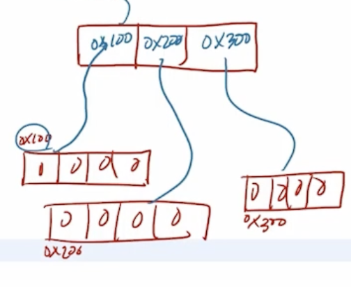
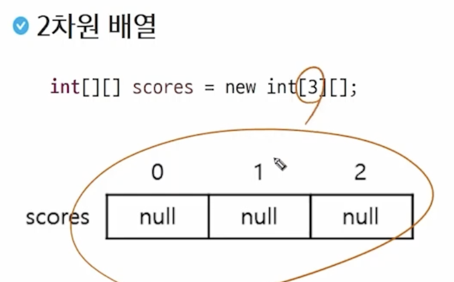

# Java(2) - 배열

# 배열

## 특징

- 같은 종류의 데이터를 저장하기 위한 자료구조
- 크기가 고정되어 있음 (한번 생성된 배열은 크기를 바꿀 수 없음)
    - 길이 변경 필요시 새로운 배열을 생성 후 내용을 옮김
- 객체로 취급 (참조형)
- 인덱스로 접근
- `배열이름.length` → 배열의 길이
- 배열의 각 요소는 해당 타입의 기본값으로 초기화 (ex. int → 0, boolean → false)

## 선언

- **데이터타입[] 배열이름;**
    - `int[] arr1;`
    - `String[] arr2;`
- 데이터타입 배열이름[];
    - `int arr3[];`

### 생성과 초기화

- 자료형[] 배열이름 = new 자료형[길이];
    - 배열 생성 (자료형의 초기값으로 초기화)
    - `int[] arr4 = new int[5];`
- 자료형[] 배열이름 = new 자료형[] {값1, 값2, 값3, 값4};
    - 배열 생성 및 값 초기화
    - `int[] arr5 = new int[] {1, 2, 3, 4};`
- 자료형[] 배열이름 = {값1, 값2, 값3, 값4};
    - 선언과 동시에 초기화
    - 제약: 선언과 동시에만 쓸 수 있다. 재할당 불가.
    - `int[] arr6 = {1, 2, 3, 4};`

| 자료형 | 기본값 | 비고 |
| --- | --- | --- |
| boolean | false |  |
| char | ‘\u0000’ | 공백 문자(null 문자) |
| byte, short, int | 0 |  |
| long | 0L |  |
| float | 0.0f |  |
| double | 0.0 |  |
| 참조형 변수 | null | 아무 것도 참조 X |

### 배열 활용 예

- for loop
    
    ```java
    int[] nums = {23, 7, 20, 11, 6};
    
    for(int i=0; i < nums.length; i++) {
        System.out.println(nums[i]);
        nums[i] *= 2;
    }
    ```
    
- for-each loop (read only)
    
    ```java
    for (int num : nums) {
        System.out.println(num);
    }
    ```
    
- 한 번에 출력할 때
    
    ```java
    System.out.println(Arrays.toString(nums));
    // [46, 14, 40, 22, 12]
    ```
    

## 배열의 복사

### 정의

배열은 생성하면 길이를 변경할 수 없다. 따라서 더 많은 저장 공간이 필요하다면 큰 배열을 생성하고 이전 배열의 값을 복사해야 한다.

### 예시

- 기본 반복문

```java
int[] tmp = new int[nums.length*2];
for(int i=0; i<nums.length; i+=) {
    tmp[i] = nums[i];
}
```

- 새로운 배열 = Arrays.copyOf(원본배열, 새로운배열의크기)

```java
int[] tmp2 = Arrays.copyOf(nums, nums.length*2);
```

- 새로운 배열 = Arrays.copyOfRange(원본배열, 시작점, 끝인덱스)

```java
int[] tmp3 = Arrays.copyOfRange(nums, 0, nums.length*2);
```

- System.arraycopy(원본배열, 원본배열의시작점, 복사배열, 복사배열의시작점, 복사길이)

```java
int[] tmp4 = new int[nums.length*2];
System.arraycopy(nums, 0, tmp4, 0, nums.length);
System.out.println(Arrays.toString(tmp4));
```

# 다차원 배열

## 정의





- 2차원 이상의 배열
- 선언 시 []가 2개 이상 → 다차원 배열이구나 !
- 배열 객체의 참조값을, 요소로 갖는 배열
- 2차원 배열: 요소로 1차원 배열의 참조(주소값)를 갖는다.
- 3차원 배열: 요소로 2차원 배열의 참조(주소값)를 갖는다.

## 선언

- **데이터타입[][] 배열이름;**
- 데이터타입 배열이름[][];
- 데이터타입[] 배열이름[];

## 생성

- 배열이름 = new 데이터타입[1차원배열길이(행)][2차원배열길이(열)];
- 배열이름 = new 데이터타입[1차원배열길이(행)][];
- 배열이름 = new 데이터타입[][] {
    {첫 번째 1차원 배열의 초기값},
    {두 번째 1차원 배열의 초기값},
    …
};

## 출력

```java
System.out.println(Arrays.deepToString(arr2));
```