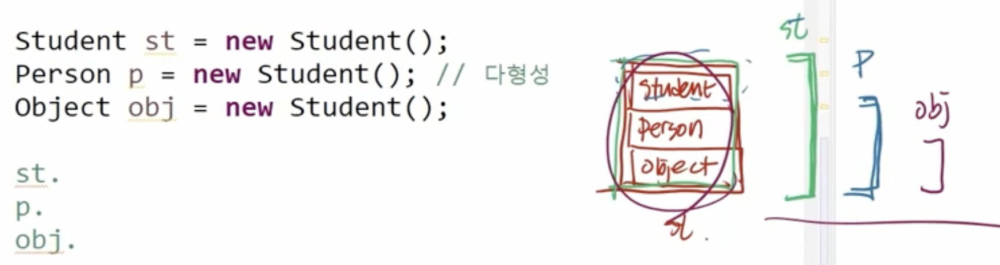
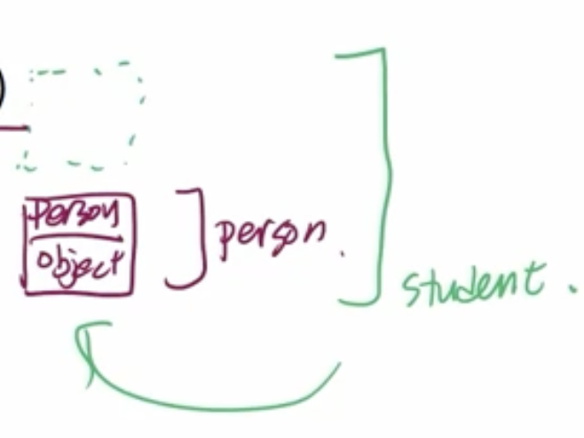

# Java(6) - 다형성과 추상클래스

# 다형성

## 특징

- 실제 하나의 객체를 다양한 타입의 참조로 사용하는 것
- 다양한 유형의 여러 객체를 하나의 공통된 타입으로 참조할 수 있는 것
- **상속 관계에 있을 때 조상 클래스 타입으로 자손 클래스의 객체를 참조할 수 있다.**
- 다양한 타입으로 참조하더라도 참조만 바뀔 뿐 실제 객체 자체(객체의 행위)는 변함이 없다.
- 하나의 이름으로 다양한 기능을 구현할 수 있다.
- 다형성의 종류
    - 임시 다형성(ad hoc polymorphism): 메서도 오버로딩, 연산자 오버로딩(자바 지원X)
    - 매개변수 다형성(Parametric polymorphism): 제네릭
    - **서브타입 다형성(Subtyping): 상속 관계에 있을 때 조상 클래스의 타입으로 자손 객체 참조 가능**
- 다형성의 장점
    - 코드 재사용성 증가, 유연성과 확장성 증가, 가독성 개선
    

## 1. 서브타입 다형성

### 특징

- 관점을 바꾼다 하더라고, 실제 메모리에 생성된 인스턴스는 변함이 없음.
- 부모 클래스의 타입으로 참조를 바꾸면, 부모 클래스에 정의된 메서드, 변수만 접근 가능하다.
- 실제 메모리에 올라와 있는 객체는 더 많은 메서드와 멤버 변수가 있더라도 접근 불가능하다.
- 관련 이미지
    
    
    

## 2. 동적 바인딩

### 특징

- 상속을 하면서, 자손 클래스에서 오버라이드 한 상황
- 타입과 관계없이 실제 객체가 가진 메서드가 호출된다.
- 타입과 관계없이 실제 객체의 행위를 한다.
- 코드
    
    ```java
    Student st = new Student();
    Person p = new Student();
    
    st.eat(); // Student의 eat() 메서드를 실행
    p.eat(); // Student의 eat() 메서드를 실행
    ```
    

## 참조변수의 형 변환

### 자손 타입(많은 정보) → 조상 타입(적은 정보)

- 묵시적 형 변환
- 형 변환 생략 가능
- 코드
    
    ```java
    Student st = new Student();
    Person p = st;
    ```
    

### 조상 타입 → 자손 타입

- 명시적 형 변환
- 형 변환 생략 불가
- (대부분 경우 불가능)
- 코드
    
    ```java
    Person p = new Person();
    Student st = (Student) p;
    ```
    
- 이미지
    
    
    

## instanceof 연산자

### 특징

- 참조변수가 참조하고 있는 인스턴스의 타입을 확인하기 위해서 사용
- 결과를 boolean으로 반환
- true가 반환 되면, 묵시적 형 변환이 가능한 상태

### 코드

```java
if (person instanceof Student) {
    Student student = (Student) person;
    student.study();
}
```

### 멤버 변수는 ?

- **멤버 메서드에만 다형성이 적용된다 !!!!!!**
- 멤버 변수는 다형성 X
- static 메서드는 다형성 X

```java
class Parent {
    String x = "parent x";
    
    public void method() {
        System.out.println("parent method.");
    }
    
    public static void static_method() {
    	System.out.println("parent static method.");
    }
}

class Child extends Parent{
    String x = "child x"; // 이런 경우는 거의 없다.
    // 멤버 변수: 하이딩.
    
    // 멤버 메서드: 오버라이드
    @Override
    public void method() {
        System.out.println("child method.");
    }
    
    public static void static_method() {
    	System.out.println("child static method.");
    }
}

public class BindingTest {
    
    public static void main(String[] args) {
    	Parent p = new Child();
    	Child c = new Child();
    	
//    	System.out.println(p.x); // parent?
    	p.method(); // child
//    	p.static_method(); // parent
//    	System.out.println(c.x); // child
    	c.method(); // child
//    	c.static_method(); // child
    	
    	// static 메서드는 어차피 클래스의 것이므로
//    	Parent.static_method();
    	
    	
    	// 다형성
    	// - 행위에 대한 내용
    	**// - 객체가 가지고 있는 메서드에만 적용**
    	// - 동적 바인딩 : 상속 + 오버라이드
    	// - 오버라이드 : 상속 관계에 있을 때, 자식 클래스가 부모 클래스의 메서드를 재정의!
    	
    	**// => 멤버 메서드에는 다형성이 적용되지만,
    	// => 멤버변수에는 다형성이 적용되지 않는다.
    	// => static 메서드에는 다형성이 적용되지 않는다.**
    }
}

```

---

# 추상 클래스 (abstract class)

## 특징

- abstract class는 상속 전용 클래스
- 클래스에 구현부가 없는 메서드가 있으므로 객체 생성 불가
- 상위 클래스 타입으로 자식을 참조할 수는 있음.
    - 코드
    
    ```java
    Chef chef1 = new Chef(); // 생성은 불가능
    Chef chef2 = new KFoodChef(); // 참조는 가능
    ```
    
- 자손 클래스에서 반드시 재정의해서 사용되기 때문에 조상의 구현이 무의미
- 메서드의 선언부만 남기고 구현부는 ;(세미콜론)으로 대체
- 구현부가 없으므로 abstract 키워드를 메서드 선언부에 추가
- abstract  키워드를 클래스 선언부에 추가
- 조상 클래스에서 상속 받은 abstract 메서드를 재정의 하지 않은 경우, 클래스 내부에 abstract 메서드가 남아있으므로, 자식 클래스도 abstract 클래스가 되어야 함
- abstract 클래스 구현의 강제를 통해 프로그램 안정성 향상

## 코드

```java
// 추상 메서드를 하나라도 가지고 있다면
// 해당 클래스로는 객체 생성이 불가 => 추상 클래스로 만들어줘야 함.
// 앞에 abstract 키워드를 붙여준다.

**abstract** class Animal {
    private String name;
    private int age;

    public Animal(String name, int age) {
        this.name = name;
        this.age = age;
    }

    **public abstract void speak();**
    // 쓰이지 않는 메서드를 아예 없앨 것이아니라
    // 추상 메서드로 만들 수 있다.
    // 추상 메서드 
    // - 본문이 없는 메서드
    // - abstract 키워드 명시
    // - 마지막에는 ;으로 끝낸다.
```

```java
// 추상 클래스의 자식 클래스는
// 1. 모든 추상 메서드를 오버라이드하던지 => 일반 클래스이므로 객체 생성 가능
// 2. 오버라이드 하지 않으면 여전히 추상 클래스로 남게됨.

public abstract class AnimalChild extends Animal{

	public AnimalChild(String name, int age) {
		super(name, age);
	}
}

```

```java
class Cat extends Animal {
    public Cat(String name, int age) {
        super(name, age);
    }
    
    // 각각의 자식 클래스에서
    // eat()은 그대로 물려받아 사용하고 있는 반면...
    // speak() 자식에서 재정의해서 사용하고 있음.

    @Override
    public void speak() {
        System.out.println("고양이가 말합니다: 야옹");
    }
}
```

## 클래스 vs 추상 클래스

|  | 클래스 | 추상 클래스 |
| --- | --- | --- |
| 정의 | 인스턴스를 생성할 수 있는 클래스 | - 추상 메서드를 포함할 수 있는 클래스 <br> - 인스턴스 생성이 불가능한 클래스 |
| 객체 생성 | 가능 | 불가 |
| 추상 메서드 | 포함 불가 | - 추상 메서드 포함 가능 <br> - 추상 메서드 없어도 추상 클래스 생성 가능 (객체 생성을 못하도록 강제) |
| 상속 | 다른 클래스에 의해 상속될 수 있음 | - 다른 클래스에 의해 상속되어 추상 메서드가 구현되어야만 객체 생성 가능 (세부 구현 강제) <br> - 하위 클래스가 추상 메서드를 모두 구현하지 않으면 하위 클래스도 추상 클래스 |
| 키워드 | `class` 키워드 | `abstract class` 키워드 |
| 목적 | 완전한 클래스를 정의하여, 해당 클래스로 객체를 생성하기 위함 | - 객체 생성 방지 <br> - 공통된 기본 기능을 정의 (코드 중복 제거) <br> - 하위 클래스에서 세부 구현 강제 |
| 타입 | 타입으로 사용 가능 | 타입으로 생성 가능 |