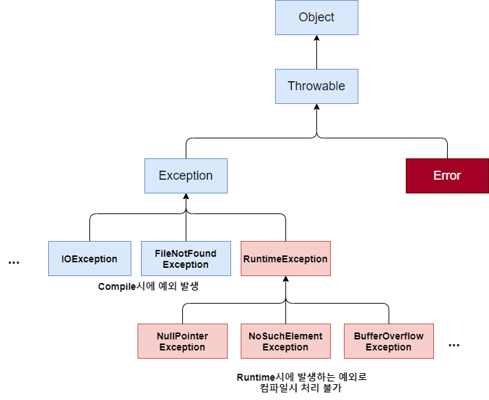

# Java(9) - 예외처리

## 오류(에러, Error)

- 어떤 원인에 의해 오동작하거나 비정상적으로 종료되는 경우

### 발생 시점에 따른 구분

- 컴파일 에러: 컴파일 도중에 컴파일러가 발견 (문법적 오류)
- 런타임 에러: 컴파일은 성공적으로 진행되었으나, 실행 중에 오류 (비정상적 종료)
- 논리적 에러: 컴파일 ok, 실행 ok, 프로그램이 의도대로 동작하지 않는 오류.

## 에러와 예외

### 에러

- 발생하면 복구할 수 없는 심각한 오류
- 메모리 부족, 스택 오버 플로우, …

### 예외

- 프로그래머가 적절한 코드를 통해 대비할 수 있는 오류
- 클래스 형 변환 실패, 파일 읽기 실패, …

# 예외처리

### 정의

- 예외 발생 시 프로그램의 비정상 종료를 막고 정상적인 실행 상태를 유지하는 것
- 예외의 감지 및 예외 발생 시 동작할 코드 작성 필요

### 예외의 종류:

- 체크 예외 Checked Exception
    - 컴파일 시점에서 예외 처리가 요구되는 예외
    - IOException, SQLException, …
- 언체크 예외 Unchecked Exception
    - Runtime Exception의 자손
    - 실행 시점에서 발생하는 예외로, 컴파일러가 예외 처리를 강제하지 않음
    - NullPointerException, ArrayIndexOutOfBoundsException, …

### 예외 클래스의 계층 구조



## 예외 처리 키워드

- 직접 처리
    - `try {}`: 예외가 발생할 가능성이 있는 코드를 포함하는 블록
    - `catch (예외 매개변수) {}`: 예외가 발생했을 때 실행할 코드 블록
    - `finally {}`: 예외 발생 여부와 상관없이 항상 실행되는 코드 블록
- 간접 처리 (처리 위임)
    - throws: 메서드 시그니처에 사용되며, 해당 메서드가 특정 예외를 던질 수 있음을 명시
- 예외를 직접 발생시킬 때
    - throw: 예외를 명시적으로 발생시키는 키워드

## 예외처리 (try ~ catch 구문)

- 프로그램 실행 시 발생할 수 있는 예외에 대한 대비코드 작성
- 프로그램의 비정상적인 종료를 막고, 정상적인 상태를 유지할 수 있도록 함
- 중괄호 생략 불가능
- 중첩된 예외처리: 블록 안에 또 다른 `try~catch` 구문이 올 수 있음

### try ~ catch 순서

```java
try {
	// (1) 예외가 발생할 수 있는 코드
	// (2) 정상 코드
} catch (SomeException e){
	// (3) 예외가 발생했을 때 처리할 코드
}
// (4) 일반 코드
```

- 예외가 발생할 때
    - catch 되었을 때: 1 → 3 → 4
    - catch 되지 않았을 때: 1 →  종료
- 예외가 발생하지 않았을 때
    - 1 → 2 → 4

### 다중 예외처리

- try 블록에서 여러 종류의 예외가 발생한 경우
- 하나의 trty 블록에 여러 개의 catch 블록 추가 가능
    - 예시 1:
        
        ```java
        try {
            int[] arr = {1};
            System.out.println(arr[1]);
        } catch (ArrayIndexOutOfBoundsException e) {
            System.out.println("배열 오류");
        } catch (Exception e) {
            System.out.println("기타 예외");
        }
        ```
        
    - 예시 2:
        
        ```java
        try {
            int num = Integer.parseInt("abc");
        } catch (NumberFormatException | XXException e) {
            System.out.println("숫자 변환 오류");
        }
        ```
        
- 유의사항
    - 예외 객체에 해당하는 catch 문장을 찾을 때는 **다형성이 적용됨**
        - 해당 예외 매개변수와 일치하거나 그 자손까지
    - 상속 관계에서 상위 타입의 예외가 먼저 선언되는 경우 뒤에 등장하는 catch 블록은 동작할 기회가 없음
    - 상속 관계가 없는 경우는 무관
    - 상속관계에서는 **작은 범위(자식)에서 큰 범위(조상) 순으로 정의**

### **Exception 인스턴스의 주요 메서드**

- `getMessage()`
    - 발생된 예외에 대한 구체적인 메시지를 반환
- `printStackTrace()`
    - 예외 발생 당시의 호출 스택(Call Stack)을 출력

### 메서드에서 예외 던지기

- 메서드 선언부에 `throws` 키워드를 사용하여 예외 작성
- 예외가 여러 개일 경우 ,를 이용하여 나열
- 메서드가 예외를 처리하는 것이 아닌 전달 (나를 호출한 곳으로)
- 조상 타입의 예외로 처리 가능 (다형성)
- 예외가 여러 개인 경우의 메서드 예시:
    
    ```java
    public void methodName() throws ExceptionType1, ExceptionType2, ExceptionType3 {
        // 메서드 내용
        if (condition1) {
            throw new ExceptionType1("예외 메시지 1");
        } else if (condition2) {
            throw new ExceptionType2("예외 메시지 2");
        } else if (condition3) {
            throw new ExceptionType3("예외 메시지 3");
        }
    }
    ```
    

### Checked Exception과 throws

- Checked Exception은 반드시 예외 처리를 해야 하는 예외
    - 컴파일러가 예외 처리 여부를 체크
    - IOException, SQLException 등
- throws 키워드를 사용하여 예외를 메서드 호출자에게 전달
    - 메서드 선언부에 throws 키워드와 함께 예외 클래스를 명시
    - 예시:
        
        ```java
        public void readFile() throws IOException {
            // 파일 읽기 로직
        }
        ```
        
- throws를 사용한 메서드를 호출할 때는 다음 두 가지 방법 중 하나를 선택
    - try-catch 블록으로 예외 처리
    - 다시 throws를 사용하여 예외를 상위 메서드로 전달

### **Throws의 의미**

- 메서드를 정의하는 프로그래머
    - 이 메서드 내에서 현재 예외를 처리하지 않음
    - 이 메서드를 사용하는 사람이 예외를 처리해서 쓰도록
    - 컴파일러가 예외 처리하도록 강제
- 메서드를 사용하는 프로그래머
    - 이 메서드는 CheckedException을 발생시킬 수 있는 메서드구나 !
    - 내가 이 예외를 처리해야겠다. 신나 ~
- 컴파일러
    - CheckedException은 원래 무조건 처리해야 하는데 . . .
    - 메서드 선언에 throws를 썼으니 이 메서드 본문 안에서는 봐줄게
    - 그러나 메서드 호출하는 쪽에서는 반드시 처리해야 돼
- 만약 프로그램 시작점인 main 메서드조차 throws한다면?
    - 예외는 처리되지 않은 채 남게 된다.
    

### Throws 활용 코드

```java
public static void main(String[] args) throws Exception {
	method1();
} // main 메서드 끝

static void method1() throws Exception {
	method2();
} // method1 끝

static void method2() throws Exception {
	throw new Exception();
} // method2 끝
```

- `method2()`에서 `thorw new Exception();`문장에 의해 예외 강제 발생
- `method2()`가 종료되면서 예외를 `method1()` 전달
- `method1()`에서도 예외처리를 해주지 않았으므로 `main()`에 예외 전달
- 결국 예외는 처리되지 않은 채 비정상적 종료가 된다.

### **메서드 재정의와 throws**

- 메서드 재정의 시 조상 클래스 메서드가 던지는 예외보다 높은 위치의 예외를 던질 수 없다.

```java
class Parent {
    void method() throws IOException {
        // 메서드 내용
    }
}

class Child extends Parent {
    // 가능
    @Override
    void method() throws FileNotFoundException {
        // 메서드 내용
    }
    
    // 불가능
    // @Override
    // void method() throws Exception {
    //     // 메서드 내용
    // }
}
```

- Child 클래스의 `method()`는 Parent 클래스의 `method()`가 던지는 IOException의 하위 예외인 FileNotFoundException을 던짐 → O
- 주석 처리된 부분처럼 상위 예외인 Exception을 던지려고 하면 컴파일 에러 발생 → 불가

## finally 구문

### 특징

finally는 예외 발생 여부와 상관 없이 언제나 실행

### 활용 코드

```java
try {
	// 예외가 발생할 가능성이 있는 코드
} catch(SomeException e){
	// 예외 처리 코드
} finally {
	// 예외 상관없이 항상 수행해야 하는 코드
}
```

- 예외 발생시: try → catch → finally
- 예외 미발생시: try → finally
- **중간에 return이 있어도 finally 블록 수행 후에 반환**

### **자동 자원 반납 구문 (try with resources)**

- 자원 등을 반납할 때 finally에서 `close()`를 통해 반납을 주로 함
- 코드가 지저분해지고 다른 예외상황을 발생시킬 수 있음

```java
try (FileInputStrea fis = new FileInputStream("test.txt") {
	// 코드 생략
} catch (IOException e) {
	e.printStackTrace();
}
```

- `try()` → 괄호 안에 객체를 생성하는 코드를 작성하면, 해당 객체는 `close()`를 호출하지 않아도 블록을 벗어나는 순간 `close()`가 호출됨
- 해당 객체의 클래스가 `AutoCloseable`이라는 인터페이스를 구현한 클래스이어야 함.
- 예시:
    
    ```java
    try (BufferedReader br = new BufferedReader(new FileReader("file.txt"))) {
        String line;
        while ((line = br.readLine()) != null) {
            System.out.println(line);
        }
    } catch (IOException e) {
        e.printStackTrace();
    }
    
    ```
    

## 사용자 정의 예외

- 기존에 정의된 예외 이외에 사용자가 직접 정의 예외를 작성할 수 있음
- 대부분 Exception 또는 RuntimeException 클래스를 상속받아 작성
    - checked exception 활용
        - 명시적 예외 처리 또는 throws 필요
        - 코드는 복잡해지지만 처리, 누락 등 오류 발생 가능성은 down)
    - runtime exception 활용
        - 묵시적 예외 처리 가능
        - 코드가 간결해지지만 예외 처리, 누락 가능성 발생